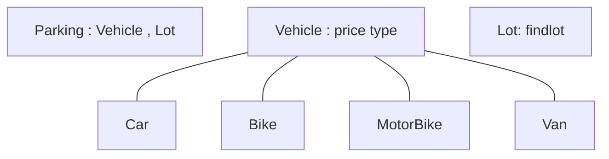
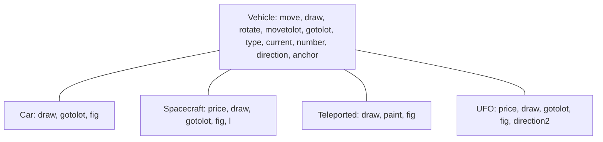

# README file of VG101 (Manuel) Project 3
Source code for VG101 Manuel Section - project 3 (regular and interstellar parking lot). Do care about the JI Honor code before running `git clone`!    
# Contributors
Yinchen Ni, Han Zhang and John Russell Himawan are the 3 major contributors to this project. I am just a debugger.
# License
This project is licensed under Apache 2.0.
           
             
	        
*The Original README file for VG101-1 FA2020 Project 3 is attached below*
# Project3


## compile option

###### for Windows

```
g++ *.cpp -Wall -Werror -Wpedantic -Wextra -Wconversion -Wsign-conversion -Wvla -std=c++11 -lglu32 -lfreeglut -lopengl32 -lm
```

###### for Linux

```
g++ *.cpp -Wall -Werror -Wpedantic -Wextra -Wconversion -Wsign-conversion -Wvla -std=c++11 -lglut -lGL -lGLU -lm
```

###### for MacOS
```
g++ *.cpp -lm -Wall -Werror -Wpedantic -Wextra -Wconversion -Wvla -Wno-deprecated-declarations -std=c++17 -framework OpenGL -framework GLUT
```

**The project has been tested** on **Windows** and **Linux**.

***see also in the Makefile***

## diagram for m1



## diagram for m2


## How to Run

- compile all the cpp files using *Makefile*
- using command argument to change the **number** of cars and the **size** of the parking-lot as well as the running **mode**, type **-h** to show the help message

#####   regular parking-lot
- all the vehicles will be parked for a random time
- if there is no empty slot, the program would show **NO EMPTY SLOT ANY MORE** and will not print tickets
- it will take some time to print all the tickets

#####  interstellar

- the species of vehicles are random 

